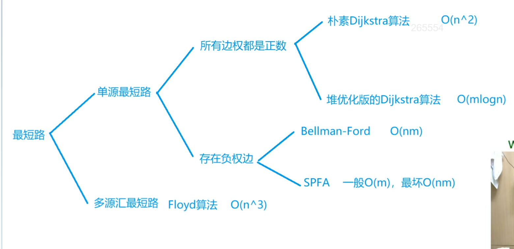

# 最短路问题

最短路算法不需要考虑有向图还是无向图，都可以用。我们只讲有向图的，无向图其实就是添加两条边，和有向图其实是一样的。

稠密图存储用邻接矩阵，稀疏图存储用邻接表。模板要背过。

其实笔试题里有很多是图的问题，但不知道为什么leetcode上面比较偏门，图的最短路问题很少。

- 单源最短路：问从1号点到N号点的最短路。
- 多源汇最短路：源点就是起点，汇点就是终点。任选两个点，从其中一个点走到另一个点的最短路。也就是说，起点和终点是不确定的。

n是点数，m是边数。朴素Dijkstra适合稠密图，堆优化版的Dijkstra适合稀疏图。

如果存在负权图，求不超过k条边的最短路，用Bellman-Ford比较好。

## 稠密图和稀疏图判断

n为点数，m为边数。如果m和n^2是一个级别，就是稠密图。如果m和n是一个级别，叫稀疏图。

## 注意

最短路算法不注重证明，重实现。题目的难点一般都是建图，怎么把题目抽象成一个图求最短路问题。

## 重边和自环

- 自环：从自己出发，又指向自己的边，就叫自环。
- 重边，就是两个点之间有多条边（权重不一样）。

### 最短路问题里如何处理重边和自环
