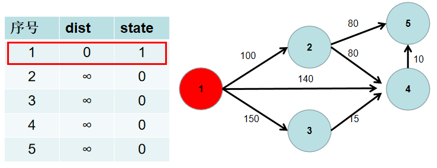
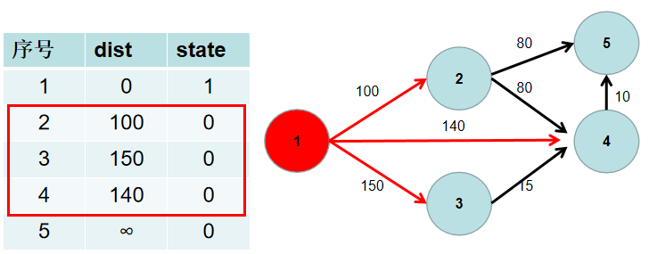
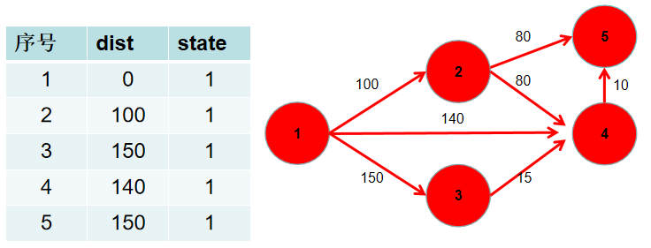

# 朴素 Dijkstra

迪杰斯特拉算法采用的是一种贪心的策略。

求源点到其余各点的最短距离步骤如下：

1. 用一个 dist 数组保存源点到其余各个节点的距离，dist[i] 表示源点到节点 i 的距离。初始时，dist 数组的各个元素为无穷大。用一个状态数组 state 记录是否找到了源点到该节点的最短距离，state[i] 如果为真，则表示找到了源点到节点 i 的最短距离，state[i] 如果为假，则表示源点到节点 i 的最短距离还没有找到。初始时，state 各个元素为假。
   
2. 源点到源点的距离为 0。即dist[1] = 0。
   
3. 遍历 dist 数组，找到一个节点，这个节点是：没有确定最短路径的节点中距离源点最近的点。假设该节点编号为 i。此时就找到了源点到该节点的最短距离，state[i] 置为 1。
   
4. 遍历 i 所有可以到达的节点 j，如果 dist[j] 大于 dist[i] 加上 i -> j 的距离，即 dist[j] > dist[i] + w[i][j]（w[i][j] 为 i -> j 的距离） ，则更新 dist[j] = dist[i] + w[i][j]。
   
5. 重复 3 4 步骤，直到所有节点的状态都被置为 1。
   
6. 此时 dist 数组中，就保存了源点到其余各个节点的最短距离。
   

## 伪代码

```
int dist[n],state[n];
dist[1] = 0, state[1] = 1;
for(i:1 ~ n)
{
    t <- 没有确定最短路径的节点中距离源点最近的点;
    state[t] = 1;
    更新 dist;
}
```

## 模板

时间复杂度是$O(n^2+m)$, n表示点数，m表示边数。

```
int g[N][N];  // 存储每条边
int dist[N];  // 存储1号点到每个点的最短距离
bool st[N];   // 存储每个点的最短路是否已经确定

// 求1号点到n号点的最短路，如果不存在则返回-1
int dijkstra()
{
    memset(dist, 0x3f, sizeof dist);
    dist[1] = 0;

    for (int i = 0; i < n - 1; i ++ )
    {
        int t = -1;     // 在还未确定最短路的点中，寻找距离最小的点
        for (int j = 1; j <= n; j ++ )
            if (!st[j] && (t == -1 || dist[t] > dist[j]))
                t = j;

        // 用t更新其他点的距离
        for (int j = 1; j <= n; j ++ )
            dist[j] = min(dist[j], dist[t] + g[t][j]);

        st[t] = true;
    }

    if (dist[n] == 0x3f3f3f3f) return -1;
    return dist[n];
}
```
