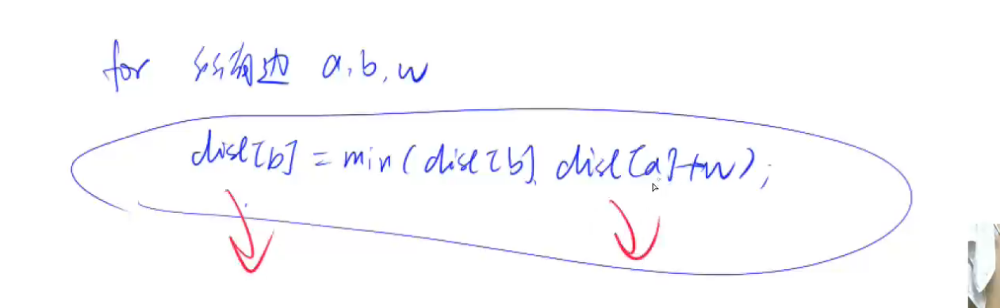

# spfa算法

## 原理

其实是对bellman-ford算法做了优化。用宽搜做优化。

终于来到SPFA算法了！之前已经说明过了Bellman_ford算法 ,我们今天说明的SPFA算法仅仅只是对该算法的一个优化。

Bellman_ford算法会遍历所有的边，但是有很多的边遍历了其实没有什么意义，我们只用遍历那些到源点距离变小的点所连接的边即可，只有当一个点的前驱结点更新了，该节点才会得到更新；因此考虑到这一点，我们将创建一个队列每一次加入距离被更新的结点。

虽然说正权图用dijkstra, 但是其实也可以用spfa做，很多都可以用spfa过掉。

## 基本思想

更新过谁，我再拿谁来更新别人。



dist[b]变小，一定是因为dist[a]变小了。也就是，只有a变小，b才会变小。只有a变小了，后继才会变小。所有用宽搜来做优化。

## 模板

时间复杂度，平均情况下 O(m)，最坏情况下 O(n*m), n表示点数，m 表示边数。

```
int n;      // 总点数
int h[N], w[N], e[N], ne[N], idx;       // 邻接表存储所有边
int dist[N];        // 存储每个点到1号点的最短距离
bool st[N];     // 存储每个点是否在队列中

// 求1号点到n号点的最短路距离，如果从1号点无法走到n号点则返回-1
int spfa()
{
    memset(dist, 0x3f, sizeof dist);
    dist[1] = 0;

    queue<int> q;
    q.push(1);
    st[1] = true;

    while (q.size())
    {
        auto t = q.front();
        q.pop();

        st[t] = false;

        for (int i = h[t]; i != -1; i = ne[i])
        {
            int j = e[i];
            if (dist[j] > dist[t] + w[i])
            {
                dist[j] = dist[t] + w[i];
                if (!st[j])     // 如果队列中已存在j，则不需要将j重复插入
                {
                    q.push(j);
                    st[j] = true;
                }
            }
        }
    }

    if (dist[n] == 0x3f3f3f3f) return -1;
    return dist[n];
```

## spfa判断负环

抽屉原理。dist[x] 表示节点x到原点的最短路长度，cnt[x] 表示当前最短路的边的个数。

如果某一次cnt[x]>=n, 就意味着从1到x至少经过了n条边，n条边就表示从1到x至少经过了n+1个点。由抽屉原理，一共只有n个点，而这条路径上有n+1个点，所以一定有2个点是相同的，也就是最短路径上存在一个环。最短路径上存在一个环不是白存在的，这个环一定能使最短路径变小。所以一定是个负环。

时间复杂度是O(n*m), n表示点数，m表示边数。

注意2点。第一，不需要初始化dist数组；第二，初始化把所有点都加入到队列中。

初始时将所有点插入队列中可以按如下方式理解：
在原图的基础上新建一个虚拟源点，从该点向其他所有点连一条权值为0的有向边。那么原图有负环等价于新图有负环。此时在新图上做spfa，将虚拟源点加入队列中。然后进行spfa的第一次迭代，这时会将所有点的距离更新并将所有点插入队列中。执行到这一步，就等价于视频中的做法了。那么视频中的做法可以找到负环，等价于这次spfa可以找到负环，等价于新图有负环，等价于原图有负环。得证。

```
int n;      // 总点数
int h[N], w[N], e[N], ne[N], idx;       // 邻接表存储所有边
int dist[N], cnt[N];        // dist[x]存储1号点到x的最短距离，cnt[x]存储1到x的最短路中经过的点数
bool st[N];     // 存储每个点是否在队列中

// 如果存在负环，则返回true，否则返回false。
bool spfa()
{
    // 不需要初始化dist数组
    // 原理：如果某条最短路径上有n个点（除了自己），那么加上自己之后一共有n+1个点，由抽屉原理一定有两个点相同，所以存在环。

    queue<int> q;
    for (int i = 1; i <= n; i ++ )
    {
        q.push(i);
        st[i] = true;
    }

    while (q.size())
    {
        auto t = q.front();
        q.pop();

        st[t] = false;

        for (int i = h[t]; i != -1; i = ne[i])
        {
            int j = e[i];
            if (dist[j] > dist[t] + w[i])
            {
                dist[j] = dist[t] + w[i];
                cnt[j] = cnt[t] + 1;
                if (cnt[j] >= n) return true;       // 如果从1号点到x的最短路中包含至少n个点（不包括自己），则说明存在环
                if (!st[j])
                {
                    q.push(j);
                    st[j] = true;
                }
            }
        }
    }

    return false;
}
```

## 题目

- 851
- 852
