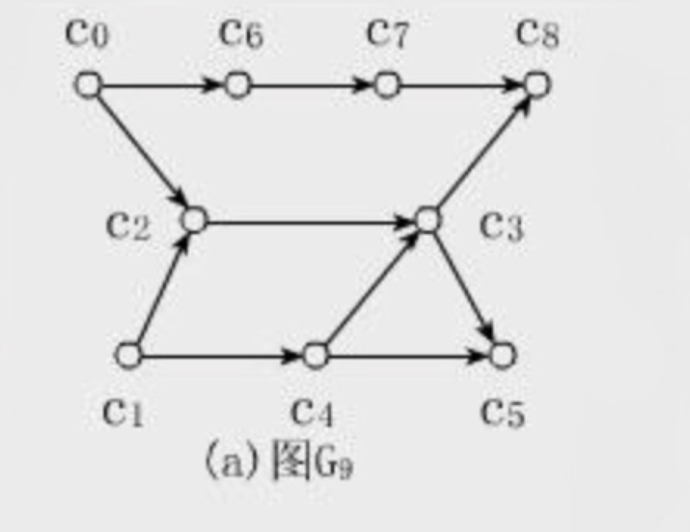
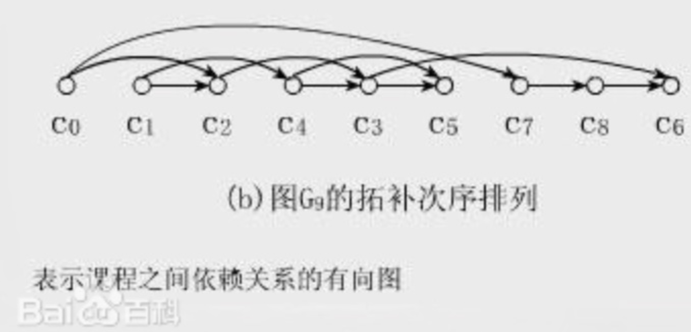
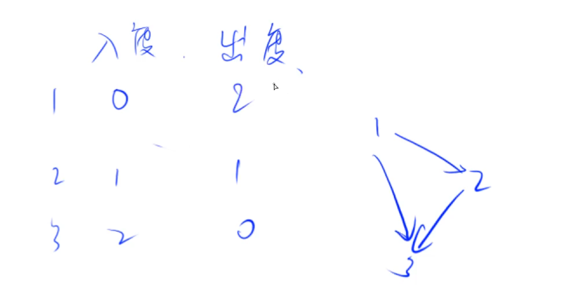
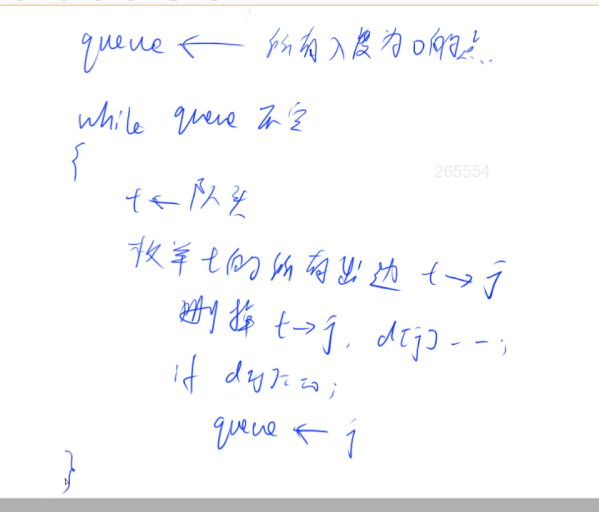

# 拓扑排序

拓扑排序一定是针对有向图来说的。

拓扑序排好以后，所有边都是从前指到后的。直观地说就是，让你把一幅图「拉平」，而且这个「拉平」的图里面，所有箭头方向都是一致的，比如上图所有箭头都是朝右的。

不是所有图都有拓扑序。很显然，如果一幅有向图中存在环，是无法进行拓扑排序的，因为肯定做不到所有箭头方向一致；反过来，如果一幅图是「有向无环图」，那么一定可以进行拓扑排序。所以，有向无环图，也被称为拓扑图。





## 入度、出度



## 拓扑排序

因为拓扑排序是所有边都是从前指向后的，所以，所有入度为0的点都可以作为起点。所以拓扑排序第一步，就是把所有入度为0的点入队，后面就是BFS的过程。

如果图中存在环，那么环上所有的点都不会入队。找不到突破口，因为环上所有点的入度都不为0.

一个有向无环图，一定至少存在一个入度为0的点。

### 思路

- 首先记录各个点的入度
- 然后将入度为 0 的点放入队列
- 将队列里的点依次出队列，然后找出所有出队列这个点发出的边，删除边，同事边的另一侧的点的入度 -1。
- 如果所有点都进过队列，则可以拓扑排序，输出所有顶点。否则输出-1，代表不可以进行拓扑排序。



## 模板

时间复杂度 O(n+m), n 表示点数，m 表示边数。

```
bool topsort()
{
    int hh = 0, tt = -1;

    // d[i] 存储点i的入度
    for (int i = 1; i <= n; i ++ )
        if (!d[i])
            q[ ++ tt] = i;

    while (hh <= tt)
    {
        int t = q[hh ++ ];

        for (int i = h[t]; i != -1; i = ne[i])
        {
            int j = e[i];
            if (-- d[j] == 0)
                q[ ++ tt] = j;
        }
    }

    // 如果所有点都入队了，说明存在拓扑序列；否则不存在拓扑序列。
    return tt == n - 1;
}
```
