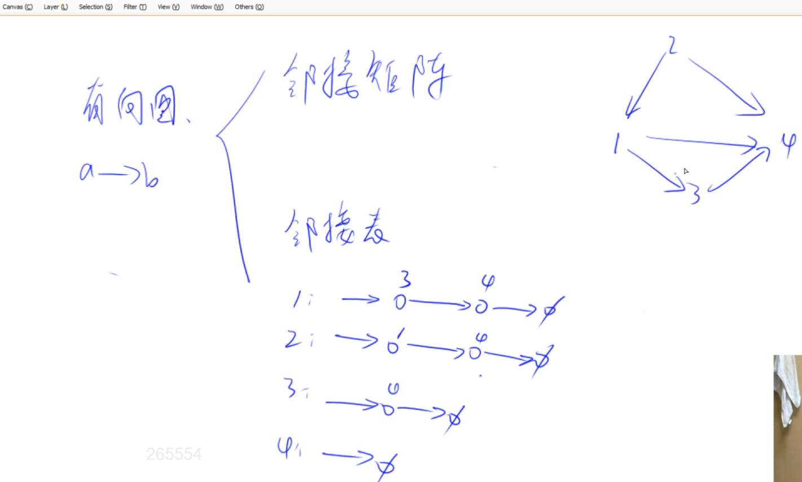

# 树和图的存储

树是一种特殊的图，与图的存储方式相同。
对于无向图中的边ab，存储两条有向边a->b, b->a。
因此我们可以只考虑有向图的存储。

(1) 邻接矩阵：g[a][b] 存储边a->b

(2) 邻接表：每个点都有一个单链表。其实就是一组单链表，跟哈希表的拉链法有点像。单链表上存什么呢？其实就是存这个点可以走到哪个点。插入一条边时，一般选择头插法。

```
// 对于每个点k，开一个单链表，存储k所有可以走到的点。h[k]存储这个单链表的头结点
int h[N], e[N], ne[N], idx;

// 添加一条边a->b
void add(int a, int b)
{
    e[idx] = b, ne[idx] = h[a], h[a] = idx ++ ;
}

// 初始化
idx = 0;
memset(h, -1, sizeof h);
```


