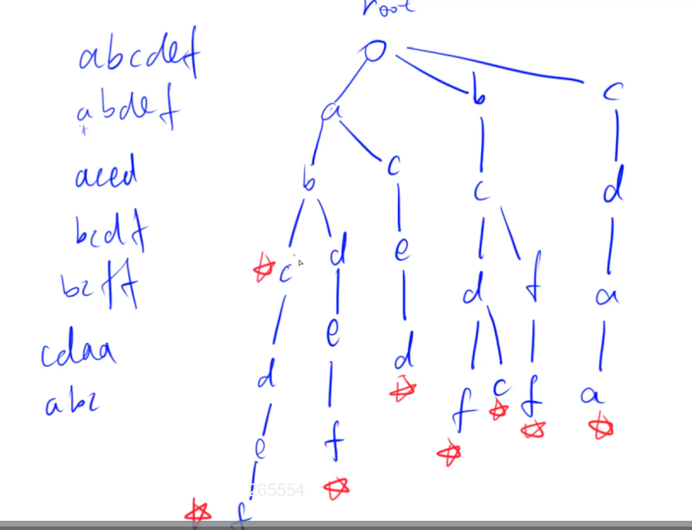

# Trie树

高效地存储和查找字符串集合的数据结构。



## 模板

```
int son[N][26], cnt[N], idx;
// 0号点既是根节点，又是空节点
// son[][]存储树中每个节点的子节点
// cnt[]存储以每个节点结尾的单词数量

// 插入一个字符串
void insert(char *str)
{
    int p = 0;
    for (int i = 0; str[i]; i ++ )
    {
        int u = str[i] - 'a';
        if (!son[p][u]) son[p][u] = ++ idx;
        p = son[p][u];
    }
    cnt[p] ++ ;
}

// 查询字符串出现的次数
int query(char *str)
{
    int p = 0;
    for (int i = 0; str[i]; i ++ )
    {
        int u = str[i] - 'a';
        if (!son[p][u]) return 0;
        p = son[p][u];
    }
    return cnt[p];
}
```

## 解惑

trie树那里，觉得可以稍微补充下怎么用数组去建树，一开始以为[N][26]的第一维度是树的层数；现在搞懂了，一维是结点总数，而结点和结点之间的关系（谁是谁儿子）存在第二个维度，比如[0][1]=3, [0]表示根节点，[1]表示它有一个儿子‘b’,这个儿子的下标是3；接着如果有一个[3][2]=8 ; 说明根节点的儿子‘b’也有一个儿子‘c’，这个孙子的下标就是8；这样传递下去，就是一个字符串。随便给一个结点][x][y], 并不能看出它在第几层，只能知道，它的儿子是谁。之所以第一维为N（N是所有字符串的最大长度），是因为trie树里可以有多个节点都是字母b，但它们是两个不同的节点。

```
son[父亲的位置][儿子的名字]=儿子的位置
```

idx相当于一个分配器，如果需要加入新的节点，就用++idx分配出一个下标。

## 题目

- 835
