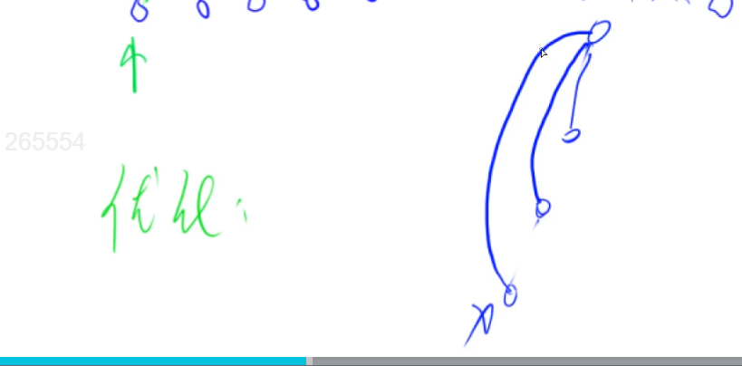
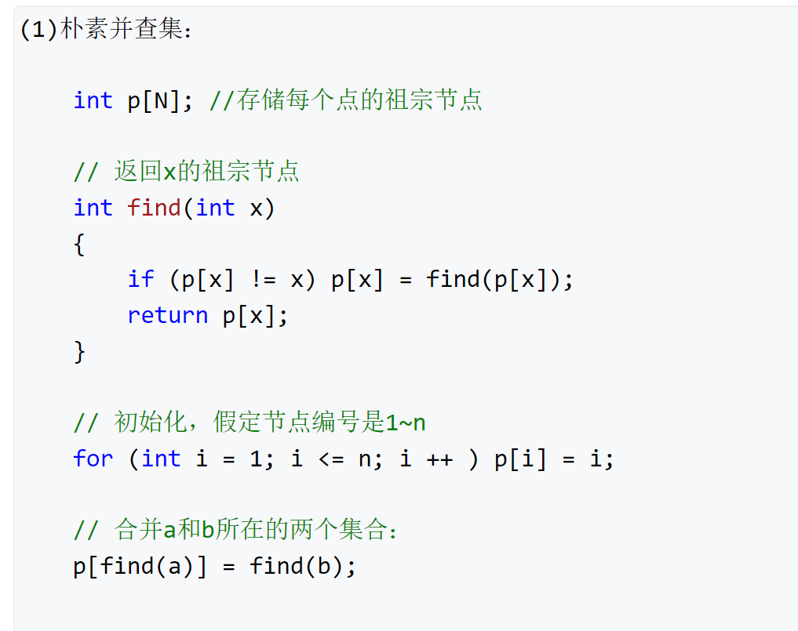
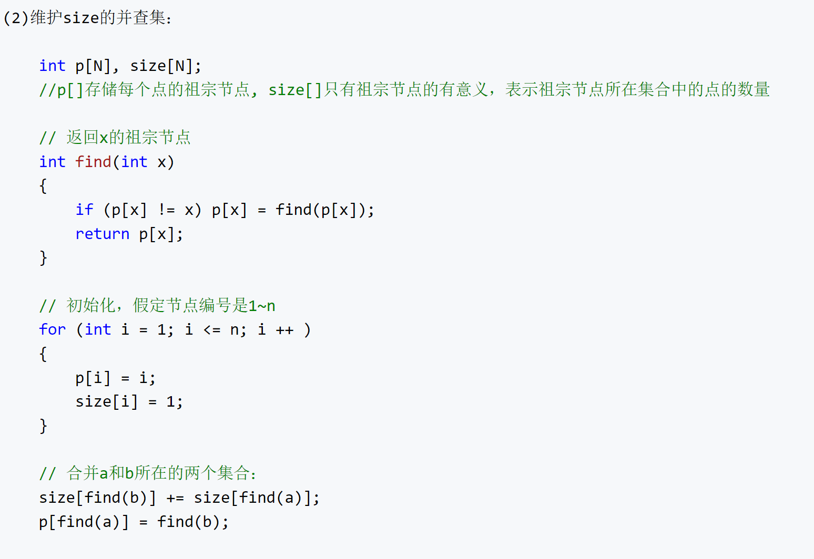

# 并查集

Union（并）-find（查） set（集）

并查集可以在近乎O(1)内完成下述两个操作：

- 将两个集合合并
- 询问两个元素是否在一个集合当中

## 基本原理

每个集合用一棵树来表示。树根的编号就是整个集合的编号。每个节点存储它的父节点，p[x]表示 x 的父节点。

- 问题1：如何判断树根：if p[x] == x
- 问题2：如何求x的集合编号：for p[x] != x  x=p[x]
- 问题3：如何合并两个集合：px是x的集合编号，py是y的集合编号，p[x]=y

## 优化

路径压缩

## 模板

